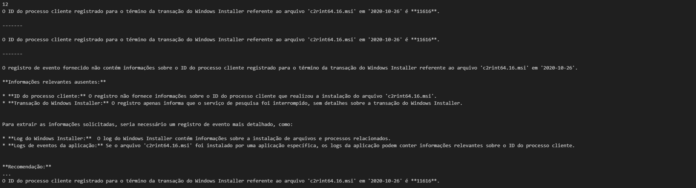
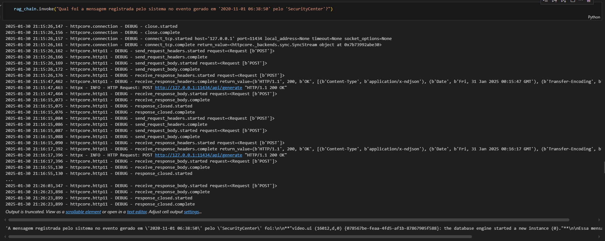
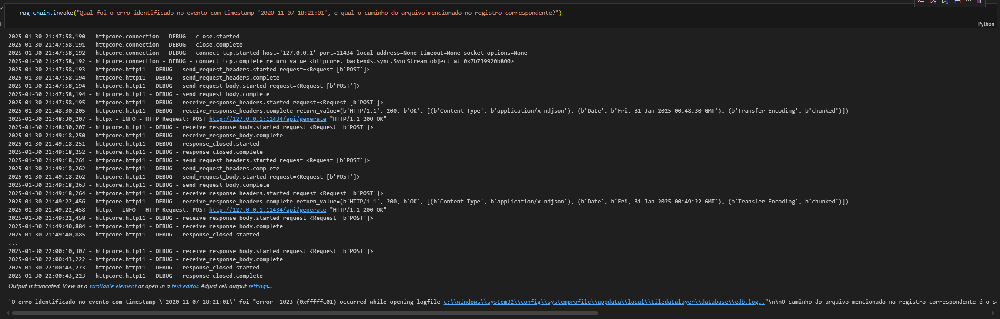
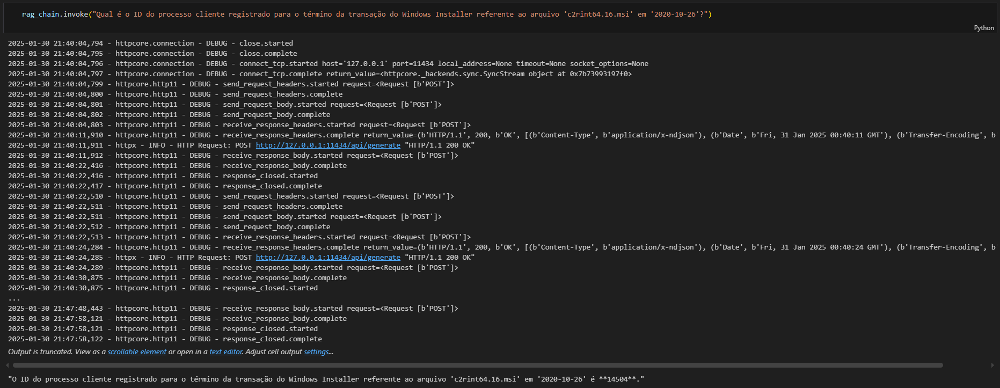

# Simplificação da análise forense de logs utilizando Grandes Modelos de Linguagem com a técnica RAG

Este repositório contém os artefatos do artigo "Simplificação da análise forense de logs utilizando Grandes Modelos de Linguagem com a técnica RAG", submetido ao Simpósio Brasileiro de Cibersegurança (SBSeg).

O objetivo deste trabalho é apresentar uma abordagem que utiliza Grandes Modelos de Linguagem (LLMs) combinados com a técnica de Retrieval-Augmented Generation (RAG) para simplificar a análise forense de logs de sistemas e redes. A solução proposta permite a detecção, correlação e interpretação de anomalias por meio de interações em linguagem natural, otimizando o processo de investigação e resposta a incidentes de segurança.

Abstract. In the digital age, the growing complexity of computer systems and the sophistication of cyberattacks significantly increase the volume of logs generated, posing challenges to cybersecurity professionals. Detecting and interpreting attacks or issues in these records are crucial for a swift response to security incidents. In this context, Large Language Models (LLMs) emerge as fundamental tools for understanding and generating natural language. This study presents an approach to analyze system and network logs, aiming to detect, correlate, and interpret anomalies using the Retrieval-Augmented Generation (RAG) technique with LLMs and interactions through targeted questions. The results demonstrate the effectiveness of the proposed approach in generating relevant insights and simplifying forensic analysis for professionals in the field.

Resumo. Na era digital, a crescente complexidade dos sistemas informáticos e a sofisticação dos ataques cibernéticos aumentam significativamente o volume de logs gerados, desafiando os profissionais de cibersegurança. A detecção e interpretação de ataques ou problemas nesses registros são essenciais para uma resposta rápida a incidentes de segurança. Nesse contexto, os Grandes Modelos de Linguagem (LLMs) destacam-se como ferramentas fundamentais na compreensão e geração de linguagem natural. Este estudo apresenta uma abordagem para analisar logs de sistemas e redes, visando detectar, correlacionar e interpretar anomalias, utilizando a técnica de \emph{Retrieval-Augmented Generation} (RAG) com LLMs e interações por meio de perguntas direcionadas. Os resultados comprovam a eficácia da abordagem proposta em gerar informações relevantes e simplificar a análise forense para profissionais da área.

# Estrutura do readme.md

1. Título do Projeto
2. Resumo e Abstract
3. Estrutura do README
4. Selos Considerados
5. Informações Básicas
    - Ambiente de desenvolvimento
    - Requisitos de hardware
    - Observações sobre desempenho
6. Dependências
7. Preocupações com Segurança
8. Instalação
    - Instalação do Python
    - Criação e ativação do ambiente virtual
    - Clonagem do repositório
    - Instalação de dependências
    - Instalação e configuração do Ollama
9. Teste Mínimo
    - Execução do Jupyter Notebook
    - Passo a passo para rodar o exemplo prático
    - Observações sobre datasets e possíveis erros
10. Experimentos
11. Licença

# Selos Considerados

Os selos considerados são: Artefatos Disponíveis (SeloD), Artefatos Funcionais (SeloF), Artefatos Sustentáveis (SeloS), Experimentos Reprodutíveis (SeloR).

# Informações básicas

Este repositório contém os artefatos necessários para a execução e replicação dos experimentos descritos no artigo. 
Abaixo estão listados os requisitos mínimos de hardware e software, bem como informações sobre o ambiente de desenvolvimento.

### Ambiente de desenvolvimento
- Sistema Operacional: Ubuntu 24.04 LTS (recomendado)
- Recomenda-se a utilização de um ambiente Linux para melhor compatibilidade.

### Requisitos de hardware mínimos
- Processador: Intel Core i3-9100 ou equivalente AMD
- Memória RAM: 16 GB
- Placa de vídeo: NVIDIA RTX 2060
- Armazenamento: 5 GB de espaço livre em disco
- Conexão com a internet: Banda larga (necessária apenas durante o download e configuração dos modelos e do sistema)

### Observações
- O uso de GPU é recomendado para acelerar o processamento dos modelos de linguagem.
- Os testes e experimentos foram conduzidos utilizando uma configuração com os requisitos acima e apresentaram desempenho satisfatório.

# Dependências
Para a execução correta dos experimentos e reprodutibilidade dos resultados, é necessário instalar as seguintes dependências e configurar os recursos de terceiros conforme descrito abaixo.

### Versão do python
- Python 3 (testado com Python 3.10)

### Principais bibliotecas
As bibliotecas essenciais utilizadas no projeto incluem:
- langchain==0.2.16
- langchain-core==0.2.39
- langchain-community==0.2.16
- langchain-ollama==0.1.3
- pandas==2.2.3
Outras dependências estão listadas no arquivo `requirements_lang_chain.txt`, que pode ser instalado com o comando:
```bash
pip install -r requirements_lang_chain.txt
```

### Modelo LLM utilizado
Este projeto utiliza o <b>LLaMA 3.22</b> com <b>3 bilhões de parâmetros</b>, instalado por meio da ferramenta Ollama. O Ollama é necessário para hospedar e interagir localmente com o modelo de linguagem.

Como instalar e rodar o modelo com Ollama:
Instale o Ollama conforme a documentação oficial: https://ollama.com/download

Após a instalação, execute o seguinte comando para baixar o modelo:
```bash
ollama run llama3
```
<b>Nota:</b> A instalação do modelo pode levar alguns minutos e requer conexão com a internet.

# Preocupações com segurança

Não há preocupações conhecidas que possam prejudicar o ambiente dos avaliadores

# Instalação
A seguir, apresentamos o passo a passo necessário para instalar e executar a aplicação localmente.

### 1. Instalar o Python 3
Certifique-se de que o Python 3 esteja instalado. Recomenda-se a versão 3.10.
No Ubuntu, você pode instalar com:
```bash
sudo apt update
sudo apt install python3 python3-venv python3-pip
```

### 2. Criar e ativar o ambiente virtual
```bash
# Criar ambiente virtual
python3 -m venv forense-rag-logs-venv
cd forense-rag-logs-venv

# Ativar ambiente virtual
source bin/activate
```

### 3. Clonar o repositório
```bash
git clone https://github.com/CGabriel22/forense-rag-logs
cd forense-rag-logs
```

### 4. Instalar as dependências
```bash
pip3 install -r requirements/requirements_lang_chain.txt
```

### 5. Instalar e configurar o Ollama
Para utilizar o modelo LLaMA localmente, é necessário instalar o Ollama:
Acesse https://ollama.com/download e siga as instruções para seu sistema

Após instalado, execute o comando abaixo para baixar o modelo LLaMA 3 com 3B de parâmetros:
```bash
# Instala o modelo principal llama3.2
ollama run llama3.2
# Instala o modelo auxiliar gemma2:2b
ollama run gemma2:2b
```
Após instalado, digite /bye para sair do modelo, instale o próximo e repita o comando.
<b>Importante:</b> A primeira execução fará o download do modelo e pode levar alguns minutos.

# Teste mínimo

Para facilitar a avaliação do artefato, disponibilizamos um notebook Jupyter com toda a estrutura de execução e um exemplo funcional ao final do arquivo.

### Passo a passo para execução:
1. Ative o ambiente virtual, caso ainda não esteja ativo:
```bash
source forense-rag-logs/bin/activate
```

2. Acesse o diretório do projeto:
```bash
cd forense-rag-logs/src
```

3. Execute o Jupyter Notebook:
```bash
jupyter notebook
```
<b>Nota:</b> Pode ser necessário instalar o jupyter lab antes pelo comando: `pip3 install jupyterlab`

4. Execute as células sequencialmente.
Ao final do notebook, há uma célula com um exemplo completo, utilizando os dados disponíveis no repositório para demonstrar o funcionamento do pipeline de análise com RAG.
<b>Nota:</b> É sugerido utilizar o vscode para melhor experiência com o notebook

### Observações:
- Todos os datasets utilizados nos testes estão incluídos no repositório(eventlog.csv = 158k logs).
- A execução mínima permite visualizar o fluxo completo: indexação, recuperação, geração de resposta e análise.
- Caso ocorra algum erro, revise a instalação das dependências ou verifique se o modelo via Ollama está em execução.

# Experimentos

## 🧪 Experimentos

Esta seção descreve os experimentos realizados para validar as principais reivindicações apresentadas no artigo. As abordagens aqui descritas foram implementadas e avaliadas de forma sistemática, com anotações manuais dos resultados, visando a verificar o impacto do uso de compressão contextual no desempenho de um sistema RAG aplicado à análise de logs de eventos.

### 🔹 Reivindicação #1: Geração estruturada de documentos a partir de logs

Para estruturar os dados de entrada, desenvolvemos uma função de pré-processamento capaz de transformar cada linha do dataset de logs em um objeto `Document`, contendo tanto o conteúdo em texto natural quanto metadados relevantes para posterior recuperação. Essa etapa considerou campos como `MachineName`, `EntryType` e `TimeGenerated`, com tratamento de exceções e logging para eventuais inconsistências.  

Essa estrutura permitiu que o pipeline de processamento subsequente operasse sobre um conjunto consistente de documentos com granularidade controlada.

### 🔹 Reivindicação #2: Embedding, armazenamento e recuperação dos logs

Os documentos foram submetidos a uma etapa de segmentação (splitting) seguida de vetorização com embeddings. O armazenamento foi realizado em uma base vetorial local. Utilizamos um `retriever` composto por diferentes estratégias (ensemble) para maximizar a cobertura de recuperação.

A experimentação dessa etapa consistiu em consultas simples com perguntas específicas, como *"Qual máquina gerou o alerta de segurança?"*, e análise qualitativa das respostas retornadas, verificando a relevância do contexto selecionado.

### 🔹 Reivindicação #3: Compressão contextual com LLM

Uma das principais contribuições deste trabalho foi a implementação de uma compressão contextual baseada em LLMs, utilizando o modelo `gemma2:2b` via Ollama. Foi desenvolvido um template de prompt com foco na extração de informações relevantes em cenários de logs de segurança, com o seguinte formato:

```
Você é um assistente especialista em análise de logs de eventos de segurança. 
Dado o seguinte evento registrado no sistema, extraia as informações mais relevantes que respondam à pergunta.

Pergunta: {question}

Registro de Evento:
{context}

Extração relevante:
```

O compressor foi integrado ao pipeline através do `ContextualCompressionRetriever`, com o objetivo de reduzir a quantidade de informação irrelevante entregue ao modelo gerador.  

Os experimentos foram conduzidos de forma controlada: para cada pergunta, foi registrada a resposta com e sem compressão. As respostas foram então avaliadas manualmente quanto à **precisão**, **concisão** e **clareza**, e categorizadas como satisfatórias ou não.

Ao final da recuperação e compressão, a query final é executada sobre o contexto reduzido.

---

### ⚙️ Recursos Utilizados

- **Modelo LLM:** llama3.2, gemma2:2b (via Ollama local)
- **Dataset:** Logs sintéticos simulando eventos de segurança
- **Ambiente de execução:**  
  - CPU, 1GB RAM  
  - Execução local (sem GPU)
  - Tempo médio por execução completa: **~15 minutos**
- **Ferramentas:** pandas, langchain, FAISS/Chroma, Ollama

---

### Exemplos de execução (Imagens)


Esta imagem apresenta um recorte do raciocínio desenvolvido ao longo deste trabalho, resultante do uso de contextual compression com o modelo gemma2:2b. O objetivo foi extrair informações relevantes e organizá-las de forma comprimida, porém mais clara e eficiente.


Exemplo de aplicação do trabalho, no qual é possível visualizar a pergunta sendo respondida na segunda célula de saída.


Outro exemplo de aplicação, em que é necessário responder a duas perguntas e correlacionar dois logs para identificar o erro. Novamente, a resposta pode ser visualizada na segunda célula de saída.


Terceiro exemplo, no qual a resposta, mais uma vez, pode ser visualizada na segunda célula de saída.

---

# LICENSE
Esse projeto está licensiado sob a licensa GNU v3.0 conforme o arquivo de licensa: [LICENSE](https://github.com/CGabriel22/forense-rag-logs/blob/main/LICENSE)
